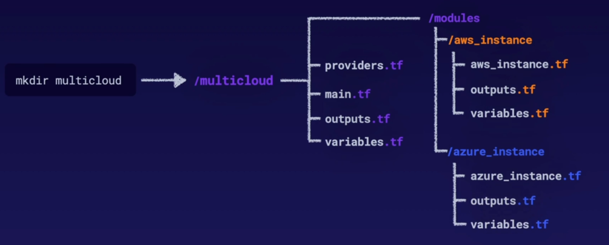

This terraform project helps to create Multi Cloud Instances. Some additional updates would be help to manage different resources on AWS and Azure.

Project Structure

terraform fmt

terraform init

ssh-keygen -t rsa -b 4096

terraform validate

terraform plan

terraform apply -auto-approve